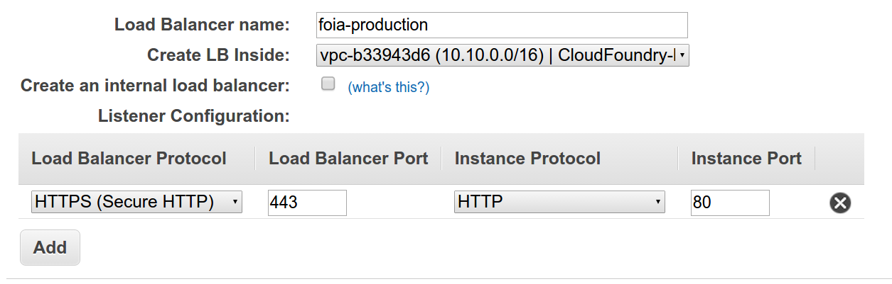

## ELB Termination

Currently, we are fronting Cloud Foundry apps with an Elastic Load Balancer (ELB) in the Cloud Foundry VPC. The ELB terminates HTTPS, and forwards HTTP traffic within the VPC.

ELBs need to be created directly in the console or through the AWS API, not using `cf` commands.

### Creating and uploading the HTTPS certificate

Create a valid HTTPS certificate using [18F's certificate issuance process](https://github.com/18F/tls-standards/tree/master/certificates), and follow the instructions there to [upload the key and certificate to the AWS ELB](https://github.com/18F/tls-standards/tree/master/certificates#in-an-elb).

The name you set as part of the ELB certificate upload command will be used later.

### Creating the ELB

* Create a new ELB in `us-east-1` (N. Virginia).

* Pick a name, and select the "Cloud Foundry live" VPC. Select HTTPS for the Load Balancer protocol, and HTTP for the Instance protocol.

* Select the HTTPS certificate that corresponds to the domain name being used for the ELB. Find it by the name you selected when you uploaded the certificate and key.

* On the "Select a Cipher" screen, select `Custom Security Policy`, and set the ciphers in accordance with [18F's standard ELB ciphersuite](https://github.com/18F/tls-standards/blob/master/configuration/elb.md#ssl-ciphers).

* Pick whatever health check makes sense (usually `/`).

* Select subnets. **__TBD__**

* Select security groups. **__TBD__**

* Choose which instance to point the Load Balancer to. **__TBD__** (`router_z1/0`? `router_z2/0`?)

* At the tag screen, **you must tag the ELB** with a tag named `client`, with the value that **corresponds to your project's assigned billing tag**.
